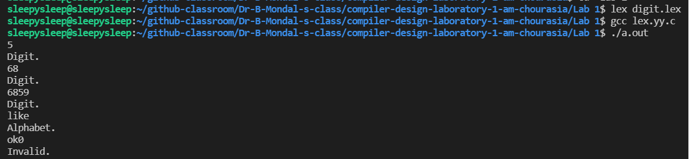

# Lab 1

| Sr. No. | Description                                                    |     Source Code     |        Output        |
| :-----: | :------------------------------------------------------------- | :-----------------: | :------------------: |
|   1.    | Write a program to recognize strings with numbers or alphabets | [Link](./digit.lex) | [Link](./output.png) |

[Link to Lab2](../Lab%202)

### Sample Input/Ouput:

```
Input : 89
Output : Digit

Input : asdf
Output : Alphabet

Input : &(&)
Output : Invalid
```

 <br>
